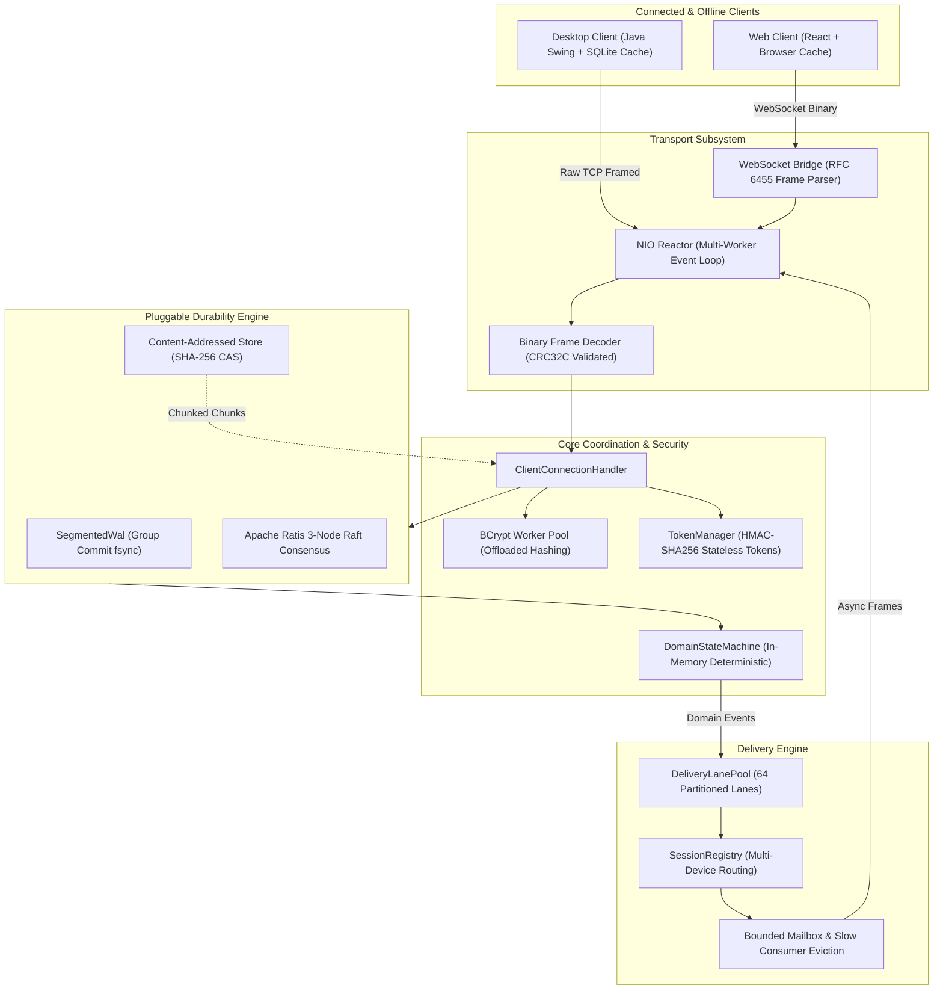

# Vibe: Durable Concurrent Social Messenger

Vibe is a distributed social messaging system built from the network socket up. Its technical core is custom non-blocking Java NIO transport, a specified binary framing protocol, explicit delivery semantics, dual durability engines (local group-commit WAL and 3-node Apache Ratis Raft consensus), bounded backpressure, and failure recovery.

Vibe couples an operational protocol inspector with a polished 3-column messenger across desktop (Java Swing + SQLite) and web (React + TypeScript).



## System Highlights

1. **Custom Binary Framing**: Replaces delimiter-delimited text with a 24-byte binary wire frame validated by hardware-accelerated CRC32C checksums. Prevents delimiter injection attacks and eliminates parsing ambiguities.
2. **Pluggable Dual Durability**:
   - **Standalone Mode**: `SegmentedWal` with coalesced group commit `fsync` (20ms batch window or 500 records), point-in-time state machine snapshotting, and automatic torn-write truncation.
   - **Replicated Mode**: 3-node distributed state machine replication powered by Apache Ratis (Raft consensus) with quorum commits and automated leader failover.
3. **Serialized Ordered Fanout**: `DeliveryEngine` partitions conversations across a 64-lane thread pool. Messages within a conversation are strictly monotonic, while distinct conversations execute concurrently.
4. **Bounded Backpressure & Slow Consumer Protection**: Client session mailboxes enforce a ceiling of 2048 pending frames or 4 MiB. Transient signals (typing, presence) are dropped under pressure; slow consumers lagging behind durable message fanout are cleanly disconnected with a resumable cursor.
5. **Offline SQLite Caching & Outbox Drainage**: Client applications continue functioning while offline. Messages are recorded locally with `PENDING_OUTBOX` status and drain automatically with server deduplication upon reconnection.
6. **Multi-Device Synchronization**: When a user logs in from multiple devices, delivery events fan out to all active sessions simultaneously, synchronizing unread states and message streams.
7. **Content-Addressed File Storage**: Real networked file transfer using 64 KiB chunks, CRC32C chunk verification, resumable upload bitsets, and two-level sharded SHA-256 deduplication.

## Repository Architecture

```
vibe/
├── protocol/           # 24-byte binary framing, CRC32C, payload codecs, typed ErrorCodes
├── transport-nio/      # Custom non-blocking Java NIO Selector reactor and connection mailboxes
├── domain/             # Deterministic domain state machine, command codecs, materialized search index
├── storage-local/      # Segmented write-ahead log with group commit fsync, snapshots, torn-tail recovery
├── storage-ratis/      # Replicated state machine using Apache Ratis Raft consensus (3-node quorum)
├── delivery/           # DeliveryEngine, 64-lane fanout pool, multi-device routing, slow consumer eviction
├── server/             # Bootstrap coordinator, TCP/WebSocket multiplexing, CAS attachment manager
├── sdk-java/           # Java client library with SQLite local cache and offline outbox
├── desktop/            # Modern 3-column desktop messenger and live operational inspector UI
├── sdk-typescript/     # TypeScript client SDK with WebSocket transport, local caching, and offline outbox
├── web/                # Responsive 3-column web messenger in React and Vite
├── benchmarks/         # VibeLoadClient uncoordinated arrival load generator and JMH benchmarks
├── tools/              # Substantive non-test source census script and raw evidence runner
├── reports/            # Collected benchmark logs, latency histograms, and verification output
├── docs/               # Architecture Decision Records (ADRs) and technical runbooks
└── Makefile            # Standardized development, test, benchmark, and verification targets
```

## Protocol Wire Frame Specification

Every frame transmitted over TCP or WebSocket adheres to a fixed 24-byte header:

```
 0                   1                   2                   3
 0 1 2 3 4 5 6 7 8 9 0 1 2 3 4 5 6 7 8 9 0 1 2 3 4 5 6 7 8 9 0 1
+-+-+-+-+-+-+-+-+-+-+-+-+-+-+-+-+-+-+-+-+-+-+-+-+-+-+-+-+-+-+-+-+
|          Magic (0x56494245 "VIBE")                            |
+-+-+-+-+-+-+-+-+-+-+-+-+-+-+-+-+-+-+-+-+-+-+-+-+-+-+-+-+-+-+-+-+
|   Version     |   Frame Type  |             Flags             |
+-+-+-+-+-+-+-+-+-+-+-+-+-+-+-+-+-+-+-+-+-+-+-+-+-+-+-+-+-+-+-+-+
|                   Correlation ID (High 32 Bits)               |
+-+-+-+-+-+-+-+-+-+-+-+-+-+-+-+-+-+-+-+-+-+-+-+-+-+-+-+-+-+-+-+-+
|                   Correlation ID (Low 32 Bits)                |
+-+-+-+-+-+-+-+-+-+-+-+-+-+-+-+-+-+-+-+-+-+-+-+-+-+-+-+-+-+-+-+-+
|                       Payload Length (Bytes)                  |
+-+-+-+-+-+-+-+-+-+-+-+-+-+-+-+-+-+-+-+-+-+-+-+-+-+-+-+-+-+-+-+-+
|                       Header CRC32C Checksum                  |
+-+-+-+-+-+-+-+-+-+-+-+-+-+-+-+-+-+-+-+-+-+-+-+-+-+-+-+-+-+-+-+-+
|                       Payload Bytes (Variable)                |
|                              ...                              |
+-+-+-+-+-+-+-+-+-+-+-+-+-+-+-+-+-+-+-+-+-+-+-+-+-+-+-+-+-+-+-+-+
```

### Frame Types

| Code | Type | Description |
| :--- | :--- | :--- |
| `0x01` | `HANDSHAKE` | Protocol version and capabilities negotiation |
| `0x02` | `HANDSHAKE_ACK` | Server capabilities confirmation and heartbeat parameters |
| `0x03` | `AUTHENTICATE` | BCrypt credential verification or HMAC token authentication |
| `0x04` | `AUTH_RESULT` | User identity binding and stateless token issuance |
| `0x05` | `TOKEN_REFRESH` | Rotating cryptographic session tokens |
| `0x06` | `COMMAND` | Durable state machine mutation request |
| `0x07` | `COMMAND_RESULT` | Monotonic sequence assignment and commit status |
| `0x08` | `SUBSCRIBE` | Registering interest in a conversation lane with cursor replay |
| `0x09` | `CONVERSATION_EVENT` | Serialized durable mutation or ephemeral signal fanout |
| `0x0A` | `ATTACHMENT_CHUNK` | 64 KiB streaming chunk with offset and CRC32C verification |
| `0x0B` | `ACKNOWLEDGE` | Recipient delivery acknowledgment updating cursor |
| `0x0C` | `RESUME` | Re-establishing an active session from a known sequence index |
| `0x0D` | `HEARTBEAT` | Bidirectional liveness probe |
| `0x0E` | `CANCEL` | Aborting in-flight operations or upload streams |
| `0x0F` | `ERROR` | Categorized 16-bit error code and diagnostic payload |

## Quickstart & Operations

### Prerequisites
- Java Development Kit (JDK) 21 or higher
- Node.js 20+ and npm
- Make

### Build and Verify Entire System
```bash
# Verify toolchains, compile all subprojects, and run census
make bootstrap

# Run full test suite, acceptance campaign, and diff check
make verify
```

### Development Server
```bash
# Start standalone Vibe server on port 9000 with HTTP inspector on port 9001
make dev
```
Open `http://localhost:9001` in your browser to inspect real-time connection mailboxes, state machine indices, and live traffic graphs.

### Run Consensus Demo Cluster
```bash
# Launch a 3-node Apache Ratis consensus cluster and open Desktop Client
make demo
```

### Run Benchmarks & Generate Raw Evidence
```bash
# Run JMH microbenchmarks and uncoordinated arrival load generator
make benchmark
```
Raw outputs are saved in `reports/benchmarks/`.

## Architecture Decision Records (ADRs)

Detailed rationale, failure analysis, and invariants are documented in `docs/adr/`:
- [ADR 0001: Custom Binary Protocol Framing and CRC32C Verification](docs/adr/0001-custom-binary-protocol-framing.md)
- [ADR 0002: Dual Durability Engine Architecture (Local WAL vs Apache Ratis)](docs/adr/0002-dual-durability-local-wal-and-ratis-consensus.md)
- [ADR 0003: Thread-Safe NIO Reactor and Connection Multiplexing](docs/adr/0003-thread-safe-nio-reactor-and-connection-multiplexing.md)
- [ADR 0004: Delivery Engine Lane Partitioning and Slow Consumer Eviction](docs/adr/0004-delivery-engine-lane-partitioning-and-slow-consumer-eviction.md)
- [ADR 0005: Content-Addressed Storage (CAS) and Chunked Resumable Uploads](docs/adr/0005-content-addressed-storage-and-chunked-attachments.md)
- [ADR 0006: SQLite Client Storage and Offline Outbox Synchronization](docs/adr/0006-sqlite-client-storage-and-offline-outbox-synchronization.md)
- [ADR 0007: Stateless Cryptographic Session Tokens and BCrypt Worker Offloading](docs/adr/0007-stateless-session-tokens-and-bcrypt-worker-offload.md)
- [ADR 0008: Sequential Reference Model, Linearizability Checking, and Fuzzing](docs/adr/0008-linearizability-reference-model-and-fuzzing-campaign.md)

## In-Depth Technical Specifications

- [Delivery Guarantees and Message Semantics](docs/delivery-guarantees.md)
- [Storage Engine, Group Commit, and Crash Recovery](docs/storage-and-recovery.md)
- [Apache Ratis Replication Operational Runbook](docs/ratis-replication-runbook.md)
- [Performance, Benchmarks, and Latency Analysis](docs/performance-and-benchmarks.md)
