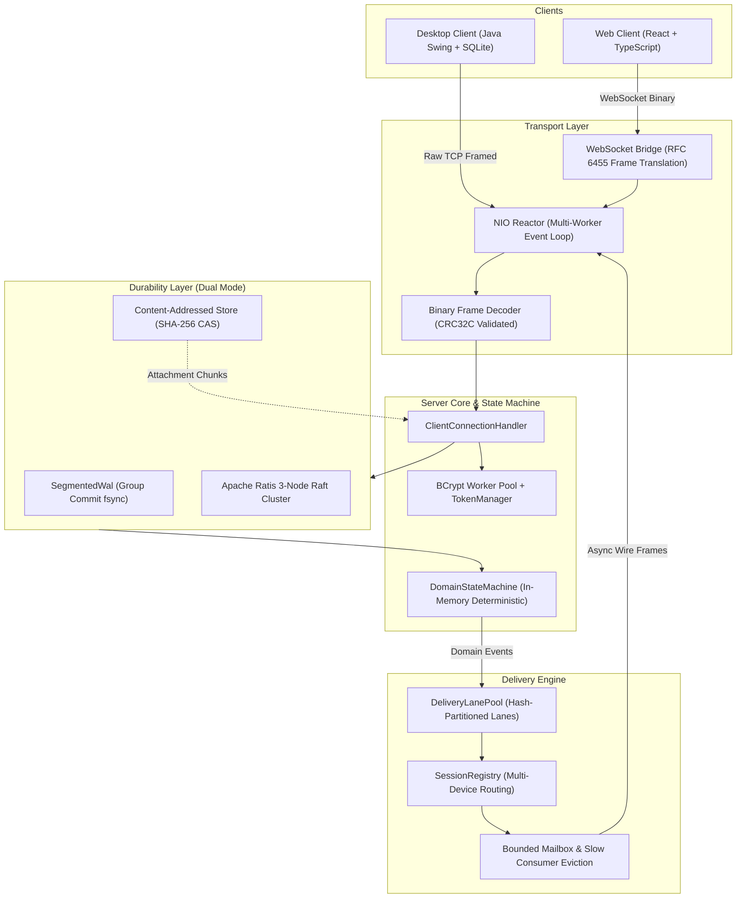

# Vibe Architecture Specification

Vibe is a distributed, high-concurrency social messenger built around explicit delivery semantics, custom non-blocking transport, dual durability engines, and failure recovery.

## Module Inventory and Ownership

| Module | Core Responsibility | Concurrency & Threading Model |
| :--- | :--- | :--- |
| `protocol` | 24-byte binary wire framing, CRC32C integrity, payload codecs, typed ErrorCodes | Pure value types and codecs; thread-safe and allocation-bounded |
| `transport-nio` | Custom Java NIO Selector reactor, worker pool, non-blocking connection mailboxes | Single acceptor thread, bounded worker selector pool, atomic buffer queues |
| `domain` | Deterministic domain state machine, command codecs, entity records, materialized search index | Synchronized state machine mutations; lock-free immutable queries |
| `storage-local` | Segmented write-ahead log with group commit fsync, snapshotting, torn-tail recovery | Dedicated background flusher thread; lock-free append queue |
| `storage-ratis` | Replicated state machine using Apache Ratis Raft consensus (3-node quorum) | Raft log replication and leader election via gRPC streams |
| `delivery` | Serialized per-conversation fanout, lane partitioning, multi-device routing, slow-consumer eviction | Fixed lane pool partitioned by conversation hash; lock-free session registry |
| `server` | Bootstrap coordinator, TCP/WebSocket multiplexing, CAS attachment manager, HTTP inspector | Composed actor pipeline coordinating transport, durability, and delivery |
| `sdk-java` | Java client SDK with SQLite local cache, offline outbox, reconnection with backoff | Background reconnect and heartbeat schedulers, synchronized local SQLite cache |
| `desktop` | Three-column desktop messenger and operational inspector UI in Java Swing | Swing Event Dispatch Thread (EDT) decoupled from network callbacks |
| `sdk-typescript` | TypeScript client library with WebSocket transport, local caching, and offline outbox | Promise-based asynchronous event emitter |
| `web` | Responsive 3-column web messenger in React and Vite | React state hooks synchronized with WebSocket client events |
| `benchmarks` | Uncoordinated arrival load generator and JMH microbenchmarks | Multi-threaded workload generation without coordinated omission |

## Core Architectural Invariants

1. **Explicit Delivery Semantics**: Messages are assigned monotonically increasing sequence numbers scoped to their conversation lane. Commits are acknowledged only after surviving disk fsync (local WAL mode) or quorum consensus (Ratis mode).
2. **Deterministic State Machine**: Every node transitions state through strictly ordered domain commands. Replaying the WAL or Raft log on a clean state machine produces byte-for-byte identical state.
3. **Bounded Concurrency & Backpressure**: Connection mailboxes enforce a ceiling of 2048 pending frames or 4 MiB. Transient signals (typing, presence) are dropped under pressure, while slow consumers lagging behind durable message fanout are disconnected with a resumable sequence cursor.
4. **Idempotent At-Least-Once Delivery**: Clients supply unique `clientMessageId` tags. Resent messages due to socket reconnects match the state machine idempotency cache and return existing commit sequences without duplicate fanout.
5. **Offline Operation**: Both desktop (SQLite) and web (browser storage) maintain local caches and append offline actions to a durable outbox that drains automatically upon reconnection.
