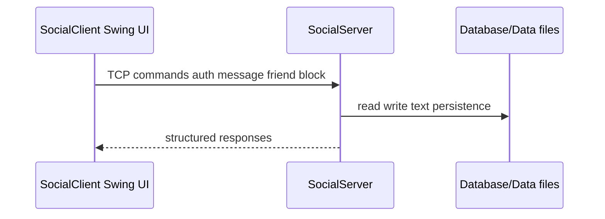

# Vibe social network

## Components

| Module | Responsibility |
| --- | --- |
| `SocialServer.java` | Socket listener, command dispatch, persistence |
| `SocialClient.java` | Swing UI, chat threads, profile editor |
| `Database/Data/` | Append-friendly text stores for users, friends, messages |
| `ServerException/` | Typed errors surfaced to the client |

The design favors explicit command strings over HTTP so the project stays a
compact illustration of client/server state machines and file-backed storage
without pulling in a database server.
