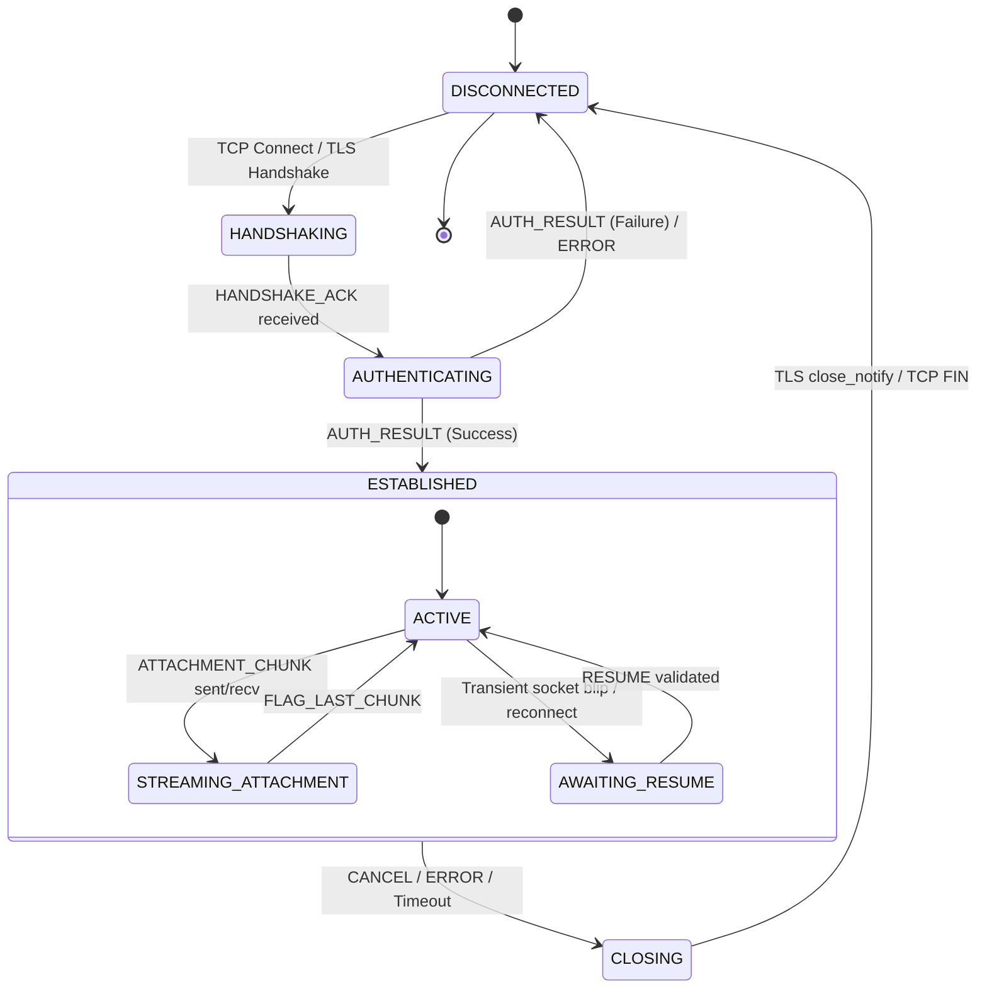

# Vibe Wire Protocol Specification (v1.0)

## 1. Overview & Transport Semantics

The Vibe Wire Protocol is a low-latency, binary, length-prefixed, multiplexed frame protocol designed for high-concurrency TCP transports with non-blocking Java NIO selectors and TLS 1.3 encryption.

### Core Properties
- **Byte Order**: Network Byte Order (Big-Endian) for all numeric fields.
- **Fixed Header Size**: 24 bytes.
- **Maximum Frame Length**: 16,777,216 bytes (16 MiB). Typical control frames are < 1 KiB; large file attachments are transferred via segmented `ATTACHMENT_CHUNK` frames (64 KiB chunks).
- **Transport Independence**: Transmitted natively over raw TCP with TLS via JSSE `SSLEngine` or over WebSocket binary frames via the server's WebSocket bridge.
- **Zero-Allocation Decoding**: Header verification, magic check, and payload length bounds checking happen before payload memory allocation.

---

## 2. Binary Frame Structure

Every frame consists of a fixed 24-byte header followed by a variable-length payload:

```
 0                   1                   2                   3
 0 1 2 3 4 5 6 7 8 9 0 1 2 3 4 5 6 7 8 9 0 1 2 3 4 5 6 7 8 9 0 1
+-+-+-+-+-+-+-+-+-+-+-+-+-+-+-+-+-+-+-+-+-+-+-+-+-+-+-+-+-+-+-+-+
|                       Magic: "VIBE"                           | (4 bytes: 0x56, 0x49, 0x42, 0x45)
+-+-+-+-+-+-+-+-+-+-+-+-+-+-+-+-+-+-+-+-+-+-+-+-+-+-+-+-+-+-+-+-+
|    Version    |  MessageType  |             Flags             | (1 byte, 1 byte, 2 bytes)
+-+-+-+-+-+-+-+-+-+-+-+-+-+-+-+-+-+-+-+-+-+-+-+-+-+-+-+-+-+-+-+-+
|                                                               |
+                    Correlation ID (int64)                     + (8 bytes)
|                                                               |
+-+-+-+-+-+-+-+-+-+-+-+-+-+-+-+-+-+-+-+-+-+-+-+-+-+-+-+-+-+-+-+-+
|                         Payload Length                        | (4 bytes, uint32, max 16 MiB)
+-+-+-+-+-+-+-+-+-+-+-+-+-+-+-+-+-+-+-+-+-+-+-+-+-+-+-+-+-+-+-+-+
|                           Header CRC                          | (4 bytes, CRC32C over first 20 bytes)
+-+-+-+-+-+-+-+-+-+-+-+-+-+-+-+-+-+-+-+-+-+-+-+-+-+-+-+-+-+-+-+-+
|                                                               |
+                     Payload Data (N bytes)                    + (0 to 16,777,216 bytes)
|                                                               |
+-+-+-+-+-+-+-+-+-+-+-+-+-+-+-+-+-+-+-+-+-+-+-+-+-+-+-+-+-+-+-+-+
```

### 2.1 Header Field Definitions

| Field | Type | Size | Description |
|---|---|---|---|
| `Magic` | `byte[4]` | 4 B | Constant ASCII `"VIBE"` (`0x56494245`). Frames not starting with this magic are rejected and the channel is terminated. |
| `Version` | `uint8` | 1 B | Protocol major version. Currently `0x01`. Unsupported versions result in `PROTOCOL_UNSUPPORTED_VERSION` error. |
| `MessageType` | `uint8` | 1 B | Frame type code (see Section 3). |
| `Flags` | `uint16` | 2 B | Bitmask flags modifying frame semantics (see Section 2.2). |
| `CorrelationId` | `int64` | 8 B | Monotonically increasing identifier set by sender for asynchronous request/response matching. Server events set this to `0` or event ID. |
| `PayloadLength`| `uint32`| 4 B | Byte length of following payload data ($0 \le L \le 16\text{ MiB}$). Strictly validated against memory limits before allocation. |
| `HeaderCRC` | `uint32`| 4 B | Castagnoli CRC32C calculated across the first 20 bytes of this header. Protects against TCP buffer corruption. |

### 2.2 Header Flags Bitmask

| Bit | Hex Value | Name | Semantic |
|---|---|---|---|
| 0 | `0x0001` | `FLAG_COMPRESSED` | Payload compressed with Zstandard (Zstd). |
| 1 | `0x0002` | `FLAG_ENCRYPTED` | Payload contains end-to-end encrypted envelope. |
| 2 | `0x0004` | `FLAG_LAST_CHUNK` | Marks the terminal chunk in a chunked streaming transfer. |
| 3 | `0x0008` | `FLAG_URGENT` | Bypasses normal consumer queue prioritization (e.g., disconnection warning, quorum alert). |
| 4 | `0x0010` | `FLAG_ONE_WAY` | Fire-and-forget: receiver must not emit a `COMMAND_RESULT`. |
| 5 | `0x0020` | `FLAG_RESUMABLE` | Event stream carries persistent durable sequence for resumption. |
| 6 | `0x0040` | `FLAG_SYNC` | Request requires synchronous durability commit acknowledgment before returning. |
| 7..15 | `0xFF80` | `RESERVED` | Reserved for future revisions; must be initialized to 0. |

---

## 3. Frame Types (`MessageType`)

| Code | Identifier | Direction | Purpose |
|---|---|---|---|
| `0x01` | `HANDSHAKE` | Client $\to$ Server | Initial protocol negotiation, client capabilities, cipher suites, device ID. |
| `0x02` | `HANDSHAKE_ACK` | Server $\to$ Client | Server protocol acceptance, session salt, server timestamp, heartbeat interval. |
| `0x03` | `AUTHENTICATE` | Client $\to$ Server | Login with credentials or token (Argon2 / BCrypt / Session JWT). |
| `0x04` | `AUTH_RESULT` | Server $\to$ Client | Authentication success with user identity, auth token, and device binding, or failure code. |
| `0x05` | `TOKEN_REFRESH` | Client $\leftrightarrow$ Server | Re-issuance of session credentials without dropping the socket. |
| `0x06` | `COMMAND` | Client $\to$ Server | Mutating or query command (send message, create group, block user, etc.). |
| `0x07` | `COMMAND_RESULT` | Server $\to$ Client | Result of command execution with committed sequence number and status. |
| `0x08` | `SUBSCRIBE` | Client $\to$ Server | Subscribe to conversation event stream starting at `lastKnownSeq`. |
| `0x09` | `CONVERSATION_EVENT`| Server $\to$ Client | Durable event fanout (new message, reaction, edit, member change). |
| `0x0A` | `ACKNOWLEDGE` | Client $\to$ Server | Delivery confirmation (`DELIVERED`) or read receipt (`READ`) with sequence cursor. |
| `0x0B` | `RESUME` | Client $\to$ Server | Reconnection request carrying session token and outbox replay cursor. |
| `0x0C` | `HEARTBEAT` | Client $\leftrightarrow$ Server | Periodic ping/pong frame for liveness and dead-peer detection. |
| `0x0D` | `ATTACHMENT_CHUNK`| Client $\leftrightarrow$ Server | Chunked byte streaming for file attachments. |
| `0x0E` | `CANCEL` | Client $\leftrightarrow$ Server | Cancellation of in-flight command or ongoing attachment stream. |
| `0x0F` | `ERROR` | Client $\leftrightarrow$ Server | Explicit typed protocol, authorization, durability, or business error. |

---

## 4. Connection Lifecycle & State Transitions



### State Invariants
1. **Unauthenticated Isolation**: Prior to receiving a successful `AUTH_RESULT`, the server reactor will immediately drop the connection if any `COMMAND`, `SUBSCRIBE`, `ACKNOWLEDGE`, or `ATTACHMENT_CHUNK` frame is received.
2. **Session Binding**: Every authenticated connection binds a unique tuple: `(AccountId, DeviceId, ConnectionId)`. Multiple devices under the same account maintain distinct connection states and distinct delivery cursors.
3. **Heartbeat Timers**: If no frame is received on an active connection for $1.5 \times \text{heartbeatInterval}$ (default 30 seconds), the reactor initiates graceful termination.

---

## 5. Typed Error Codes

Errors are transmitted in the `ERROR` frame (`0x0F`) with a 16-bit categorized error code, human-readable UTF-8 message, and optional contextual payload.

### 5.1 Protocol Errors (`0x1000` - `0x1FFF`)
- `0x1001`: `ERR_PROTOCOL_MALFORMED_HEADER`: Magic mismatch, header CRC failure, or truncated header.
- `0x1002`: `ERR_PROTOCOL_UNSUPPORTED_VERSION`: Version mismatch.
- `0x1003`: `ERR_PROTOCOL_FRAME_TOO_LARGE`: Frame size exceeds maximum threshold.
- `0x1004`: `ERR_PROTOCOL_INVALID_STATE`: Frame type disallowed in current connection state.
- `0x1005`: `ERR_PROTOCOL_DECODING_FAILURE`: Payload does not conform to message schema.

### 5.2 Authorization Failures (`0x2000` - `0x2FFF`)
- `0x2001`: `ERR_AUTH_INVALID_CREDENTIALS`: Incorrect username or password.
- `0x2002`: `ERR_AUTH_TOKEN_EXPIRED`: Session token expired; refresh required.
- `0x2003`: `ERR_AUTH_TOKEN_INVALID`: Cryptographic signature check failed on token.
- `0x2004`: `ERR_AUTH_FORBIDDEN`: User lacks permission for target conversation or administrative action.
- `0x2005`: `ERR_AUTH_DEVICE_REVOKED`: Device has been logged out or revoked.

### 5.3 Overload & Backpressure (`0x3000` - `0x3FFF`)
- `0x3001`: `ERR_OVERLOAD_QUEUE_FULL`: Server mailbox / inbound task queue full.
- `0x3002`: `ERR_OVERLOAD_RATE_LIMIT_EXCEEDED`: Client exceeded token bucket send rate.
- `0x3003`: `ERR_OVERLOAD_SLOW_CONSUMER`: Client delivery queue overflowed; server disconnected client with resumable cursor.

### 5.4 Unavailable Durability (`0x4000` - `0x4FFF`)
- `0x4001`: `ERR_DURABILITY_QUORUM_LOST`: Raft consensus group lost majority.
- `0x4002`: `ERR_DURABILITY_LEADER_STEPDOWN`: Raft leader stepped down during consensus commit; client should retry.
- `0x4003`: `ERR_DURABILITY_DISK_FULL`: Local write-ahead log cannot allocate space for group fsync.
- `0x4004`: `ERR_DURABILITY_TIMEOUT`: Durability engine did not achieve quorum within configured deadline.

### 5.5 Business & Domain Rejections (`0x5000` - `0x5FFF`)
- `0x5001`: `ERR_DOMAIN_USER_NOT_FOUND`: Specified user does not exist.
- `0x5002`: `ERR_DOMAIN_USER_ALREADY_EXISTS`: Username already registered.
- `0x5003`: `ERR_DOMAIN_USER_BLOCKED`: Communication blocked by sender or recipient privacy settings.
- `0x5004`: `ERR_DOMAIN_CONVERSATION_NOT_FOUND`: Conversation ID unknown to state machine.
- `0x5005`: `ERR_DOMAIN_NOT_A_MEMBER`: User is not a participant in target conversation.
- `0x5006`: `ERR_DOMAIN_IDEMPOTENCY_CONFLICT`: `clientMessageId` reused with different content or parameters.
- `0x5007`: `ERR_DOMAIN_MESSAGE_NOT_FOUND`: Target message ID for edit/reaction/deletion does not exist.

---

## 6. Schema-Bound Payload Definitions

All string fields are encoded with a 2-byte unsigned length prefix followed by UTF-8 bytes (`[length: uint16][bytes: utf8]`). UUIDs are encoded as 16 raw bytes (`[mostSigBits: int64][leastSigBits: int64]`).

### 6.1 `HANDSHAKE` (`0x01`)
```
[clientVersion: uint32]
[clientIdLength: uint16][clientId: utf8]
[deviceIdLength: uint16][deviceId: utf8]
[capabilities: uint32]
```

### 6.2 `HANDSHAKE_ACK` (`0x02`)
```
[serverVersion: uint32]
[heartbeatIntervalMs: uint32]
[maxFrameSize: uint32]
[serverEpochTimestamp: int64]
[sessionSaltLength: uint16][sessionSalt: byte[]]
```

### 6.3 `AUTHENTICATE` (`0x03`)
```
[authMethod: uint8] (0x01: Password, 0x02: Token)
[usernameLength: uint16][username: utf8]
[credentialLength: uint16][credential: utf8 or binary token]
[deviceIdLength: uint16][deviceId: utf8]
```

### 6.4 `AUTH_RESULT` (`0x04`)
```
[status: uint8] (0x00: Success, 0x01: Failure)
[userIdLength: uint16][userId: utf8]
[tokenLength: uint16][token: utf8]
[tokenExpiresAt: int64]
[errorCode: uint16]
[errorMessageLength: uint16][errorMessage: utf8]
```

### 6.5 `COMMAND` (`0x06`)
```
[commandType: uint16]
[clientMessageIdLength: uint16][clientMessageId: utf8] (Idempotency key)
[conversationId: uuid (16 bytes)]
[bodyLength: uint32][body: binary payload specific to commandType]
```

### 6.6 `COMMAND_RESULT` (`0x07`)
```
[status: uint8] (0x00: Success, 0x01: Rejected)
[assignedSeq: int64] (Monotonic conversation sequence assigned by committed state machine)
[committedTimestamp: int64]
[errorCode: uint16]
[payloadLength: uint32][payload: binary]
```

### 6.7 `SUBSCRIBE` (`0x08`)
```
[conversationId: uuid (16 bytes)]
[lastKnownSeq: int64] (Client requests events strictly > lastKnownSeq)
[limit: uint32]
```

### 6.8 `CONVERSATION_EVENT` (`0x09`)
```
[conversationId: uuid (16 bytes)]
[seqNumber: int64] (Strictly monotonic within conversation)
[eventId: uuid (16 bytes)]
[eventType: uint16] (0x01: MessageSent, 0x02: MessageEdited, 0x03: MessageDeleted, 0x04: ReactionAdded, 0x05: MemberJoined, 0x06: MemberLeft)
[senderUserIdLength: uint16][senderUserId: utf8]
[timestamp: int64]
[payloadLength: uint32][payload: event-specific binary]
```

### 6.9 `ACKNOWLEDGE` (`0x0A`)
```
[conversationId: uuid (16 bytes)]
[ackType: uint8] (0x01: DELIVERED, 0x02: READ)
[upToSeq: int64] (Cumulative sequence cursor acknowledged)
[ackTimestamp: int64]
```

### 6.10 `ATTACHMENT_CHUNK` (`0x0D`)
```
[attachmentId: uuid (16 bytes)]
[chunkIndex: uint32]
[totalChunks: uint32]
[checksumCRC32C: uint32]
[chunkDataLength: uint32][chunkData: byte[]]
```

---

## 7. Socket Framing & Incremental Decoding Invariants

1. **Incremental Buffering**: The decoder maintains an internal accumulator buffer per connection. If a socket read delivers fewer than 24 bytes, the selector reactor leaves the partial data in the buffer and waits for subsequent `OP_READ` notifications.
2. **Buffer Compaction**: When frames are sliced from a direct `ByteBuffer`, the remaining unread bytes are compacted using `ByteBuffer.compact()` or held in a ring buffer to avoid memory copies.
3. **Frame Packing**: Multiple consecutive frames arriving in a single TCP packet or TLS record are processed in a single reactor pass without yielding the thread prematurely.
4. **Slow Producer / Stalled Peer**: Channels with partial frames that remain uncompleted for longer than the connection idle timeout are safely reaped.
