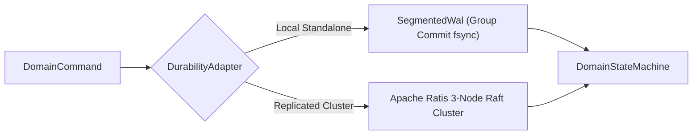

# ADR 0002: Dual Durability Engine Architecture (Local WAL vs Apache Ratis Consensus)

## Status
Accepted

## Context
A durable messenger requires guaranteed durability before acknowledging commits to clients. Two distinct operating environments exist:
1. Single-node local deployments: low resource footprint, fast startup, standalone development.
2. High-availability cluster deployments: surviving node failures, network partitions, and leader crashes without data loss.

Coursework prototypes traditionally rewrite text files sequentially or omit crash recovery entirely.

## Decision
We implemented a pluggable durability abstraction (`DurabilityAdapter`) with two interchangeable backend engines:
1. `LocalDurabilityAdapter`: In-process segmented write-ahead log (`SegmentedWal`) using group commit fsync batching.
2. `RatisDurabilityAdapter`: Replicated state machine using Apache Ratis Raft consensus across a 3-node cluster.

### Technical Design
- **Local WAL Engine**:
  - Pre-allocated 64 MiB segments named `wal-<firstIndex>.log`.
  - Group commit flusher thread coalesces concurrent appends within a configurable batch window (default 20ms or 500 records), issuing a single `FileChannel.force(false)` for all queued callers.
  - Torn write detection: truncated tail records at segment boundary are safely discarded during recovery; middle-segment corruptions trigger fail-stop errors.
- **Ratis Raft Engine**:
  - Standard Raft consensus protocol using Apache Ratis 3.1.2.
  - Commands serialized via `DomainCommandCodec` into consensus log entries.
  - State machine replication: `VibeRatisStateMachine` applies committed transactions to the deterministic `DomainStateMachine`.
  - Quorum commits: write operations acknowledge only after surviving majority disk replication across independent nodes.

## Consequences
- Positive: Clean separation of state machine semantics from physical persistence.
- Positive: Identical domain tests run against both single-node WAL and multi-node Raft backends.
- Tradeoff: Ratis cluster introduces inter-node network latency on commits compared to local group commit fsync.
