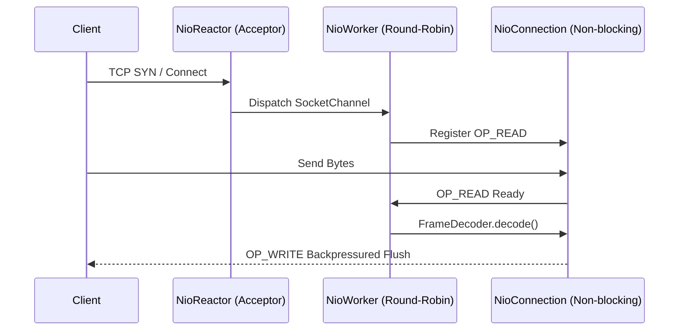

# ADR 0003: Thread-Safe NIO Reactor and Connection Multiplexing

## Status
Accepted

## Context
The legacy implementation spawned a dedicated Java thread per client connection (`new Thread(clientHandler).start()`) while synchronizing globally via a single reentrant lock (`lock.lock()`). This pattern:
1. Created severe thread-per-client memory overhead (stack allocation per thread).
2. Suffered from catastrophic lock contention under concurrent load.
3. Lacked backpressure on network writes, leading to unbounded buffer growth.

## Decision
We engineered a non-blocking Java NIO reactor with a single acceptor selector and a bounded worker selector pool (`NioReactor` and `NioWorkerPool`).

### Technical Design
- **Acceptor Loop**: A dedicated selector thread handles `OP_ACCEPT` and round-robins incoming `SocketChannel` instances across worker threads.
- **Worker Pool**: Configured with `min(availableProcessors, 16)` worker threads, each driving its own NIO `Selector`.
- **Atomic Mailbox Queues**: Outgoing frames are enqueued into an `MpscQueue` on the connection. The worker sets `OP_WRITE` interest only when outgoing data is pending, clearing it once the kernel socket buffer absorbs the queued bytes.
- **Thread Safety**: Handshake state and session credentials transition through atomic references without global locks.

## Consequences
- Positive: Scales to thousands of active client connections on minimal thread counts.
- Positive: Zero global locking in the network I/O path.
- Tradeoff: Asynchronous buffer management requires careful buffer reuse and lifecycle management to prevent memory leaks.
