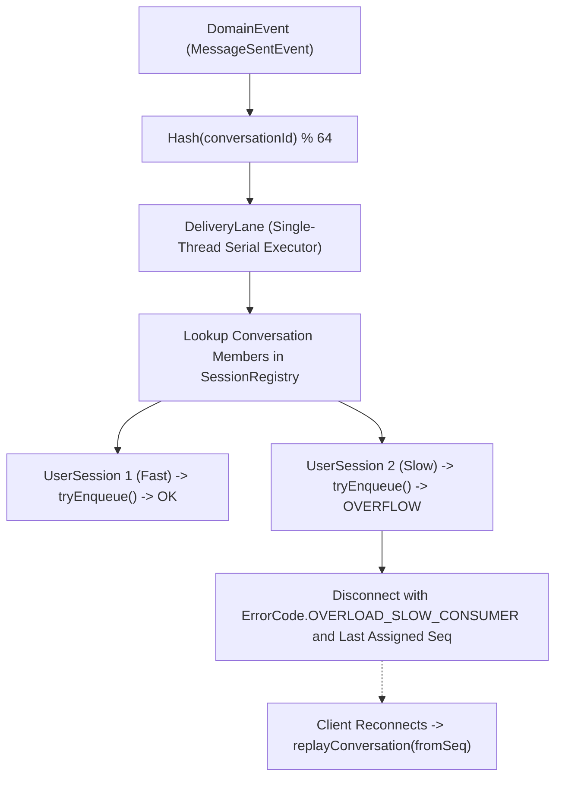

# ADR 0004: Delivery Engine Lane Partitioning and Slow Consumer Eviction

## Status
Accepted

## Context
When multiple conversations receive concurrent traffic, a naive fanout engine either:
1. Fans out on a single thread, causing chat lanes to block each other.
2. Dispatches each event onto an unbounded thread pool, violating per-conversation message ordering.
3. Allows slow consumers (clients on high-latency links or with stalled TCP windows) to exhaust server memory by buffering unbounded queues.

## Decision
We engineered `DeliveryEngine` around two primary mechanisms:
1. Fixed hash-partitioned delivery lanes (`DeliveryLanePool`) for strictly ordered parallel fanout.
2. Bounded session queue capacity with signal coalescing and resumable cursor eviction.

### Invariants & Guarantees
- **Ordered Parallelism**: Every event belonging to a given `conversationId` is assigned to exactly one `DeliveryLane`. Messages within the same channel are guaranteed to fan out in exact monotonic sequence order. Distinct channels execute completely concurrently.
- **Multi-Device Synchronization**: When a user is logged into multiple devices (e.g. mobile phone and desktop workstation), the engine fans out to all registered active sessions of that user simultaneously.
- **Transient vs Durable Shedding**: Transient non-durable signals (typing status, presence pings) are dropped immediately when queue capacity exceeds thresholds. Durable messages are never silently dropped: if a client queue exceeds 2048 frames or 4 MiB, the session is terminated with an explicit cursor error frame (`OVERLOAD_SLOW_CONSUMER`).
- **Resumable Cursors**: Upon reconnecting, the client presents its last acknowledged sequence number, and the engine replays missed committed events via `replayConversation()`.

## Consequences
- Positive: Predictable bounded memory usage under heavy load.
- Positive: Monotonic sequence delivery per conversation without global synchronization.
- Tradeoff: Slow consumers experience connection churn under sustained network degradation, but server stability and fast clients remain protected.
