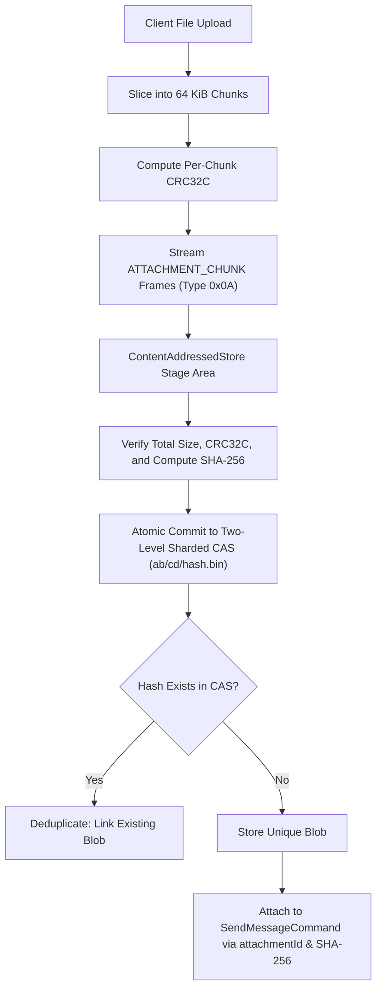

# ADR 0005: Content-Addressed Storage (CAS) and Chunked Resumable Uploads

## Status
Accepted

## Context
The legacy application transferred attachments by copying absolute filesystem paths (`/Users/foo/image.png`) across the network, failing completely across different machines and operating systems.
Furthermore, transmitting multi-megabyte binary attachments through the primary command protocol stream stalls high-priority text frames and consumes large contiguous buffers.

## Decision
We engineered a standalone Content-Addressed Store (`ContentAddressedStore`) and chunked transfer engine (`AttachmentManager`):

### Technical Design
1. **64 KiB Chunking**: Slicing large files avoids high latency spikes in the NIO reactor loop and multiplexes file uploads alongside chat messages.
2. **Resumable Bitset Tracking**: In-flight uploads maintain a bitset of received chunks. If a connection drops, clients can query missing chunk indices and retransmit only the unreceived chunks.
3. **Two-Level Sharded Directory**: Final blobs are committed to a content-addressed directory hierarchy using the first 4 characters of their SHA-256 hash (e.g. `cas/data/3a/7f/3a7f8b9e...bin`), preventing single-directory inode limits on POSIX filesystems.
4. **Deduplication**: Identical files uploaded across different conversations or users share the exact same underlying CAS blob, verified by cryptographic hash equality.

## Consequences
- Positive: True networked file transfer independent of local filesystem paths.
- Positive: Deduplication eliminates redundant storage for viral media and shared documents.
- Positive: Resumable chunking allows reliable transfer across unstable networks.
