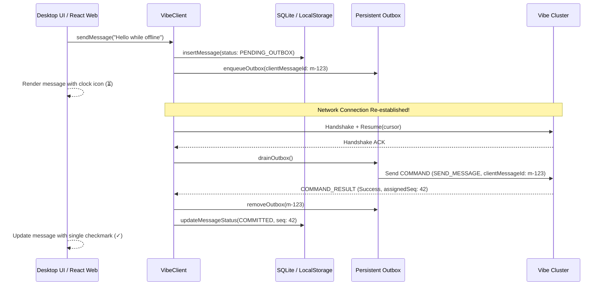

# ADR 0006: SQLite Client Storage and Offline Outbox Synchronization

## Status
Accepted

## Context
Social messengers frequently encounter intermittent connectivity, network transitions, and temporary server restarts. A modern client must:
1. Allow immediate UI rendering from local persistent cache without blocking on network round-trips.
2. Accept user messages while offline, queuing them persistently.
3. Automatically drain the offline queue upon reconnection while preserving ordering and handling server idempotency.

## Decision
We implemented a local persistent storage engine for the Java SDK (`SqliteClientStorage`) backed by SQLite JDBC and a browser storage adapter for the TypeScript SDK.

### Technical Design
- **Local SQLite Schema**:
  - `conversations`: metadata, type, title, last acknowledged sequence.
  - `messages`: messageId, conversationId, sender, content, delivery status, timestamp, attachment metadata.
  - `outbox`: ordered table containing serialized command payloads, retry counts, and creation timestamps.
  - `contacts`: contact graph, friend request status, block state.
- **Delivery States**:
  - `PENDING_OUTBOX`: queued locally; not yet acknowledged by server.
  - `COMMITTED`: persisted to server WAL or Raft log.
  - `DELIVERED`: confirmed received by target recipient session.
  - `READ`: confirmed rendered by recipient.
  - `FAILED`: rejected by server business rule or max retries exceeded.
- **Idempotency Tagging**: Every outbox item retains its immutable `clientMessageId`. If network ACK is lost after server commit, retransmissions match server deduplication caches without double-posting.

## Consequences
- Positive: Instant UI responsiveness and zero data loss during network disruptions.
- Positive: Clear visual status indicators reflecting real distributed delivery phases.
