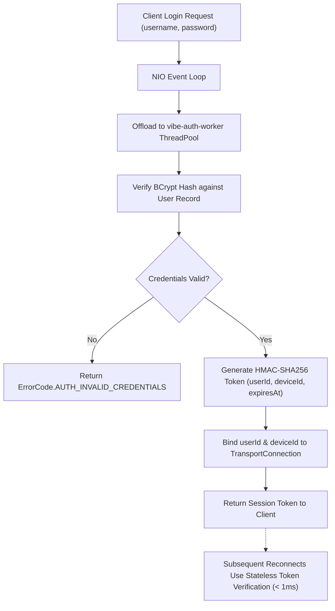

# ADR 0007: Stateless Cryptographic Session Tokens and BCrypt Worker Offloading

## Status
Accepted

## Context
The legacy application stored cleartext user passwords in `userData.txt` and transmitted unauthenticated identity strings (`callerUserId`) on socket connections. This created two critical security vulnerabilities:
1. Cleartext credential storage and credential leakage (`getUser` returned the password).
2. Trivial connection spoofing: any client could impersonate any user on the socket.

Additionally, BCrypt password hashing is intentionally CPU-intensive (~50-100ms per verification). Running BCrypt inside non-blocking NIO reactor threads would freeze the event loop and stall all connected clients.

## Decision
We implemented BCrypt salted password hashing with worker pool offloading, alongside stateless HMAC-SHA256 session tokens:

### Technical Design
1. **BCrypt Worker Offloading**: `ClientConnectionHandler` maintains a dedicated bounded thread pool (`vibe-auth-worker-N`). Password verification runs asynchronously on this pool; the NIO selector remains non-blocking and receptive to ongoing traffic.
2. **Stateless Session Tokens (`TokenManager`)**:
   - Format: `base64(userId:deviceId:expiresAt).HMAC-SHA256(payload, secretKey)`
   - Constant-time signature comparison prevents timing attacks.
   - Reconnecting clients present their token in the `AUTHENTICATE` frame. Verification is a single fast HMAC operation, avoiding repeated BCrypt calculations.
3. **Strict Socket Identity Binding**: Upon successful authentication, `connection.setUserId(userId)` and `connection.setDeviceId(deviceId)` bind identity to the socket. Subsequent commands (`handleCommand`) verify that `command.callerUserId().equals(connection.userId())`, rejecting spoofing attempts with `AUTH_FORBIDDEN`.

## Consequences
- Positive: High security against credential theft and socket spoofing.
- Positive: NIO event loop remains completely unblocked during user authentication bursts.
- Tradeoff: Token revocation requires maintaining a device revocation blacklist in the domain state machine.
