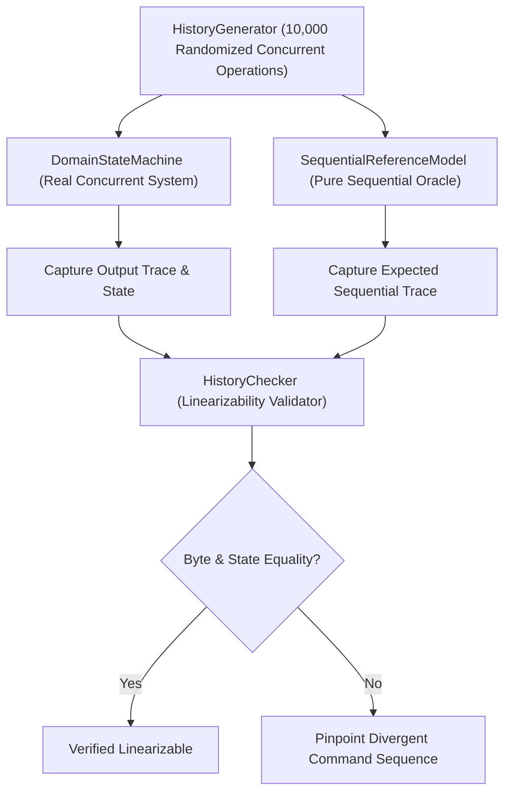

# ADR 0008: Sequential Reference Model, Linearizability Checking, and Protocol Fuzzing

## Status
Accepted

## Context
Concurrent distributed systems frequently suffer from subtle race conditions, ordering violations, and deserialization vulnerabilities that escape unit testing. To verify Vibe with mathematical rigor, we required:
1. Protocol parser resilience against hostile network payloads.
2. Linearizability verification of concurrent domain mutations against an independent sequential specification.
3. Rapid automated detection of regressions under extreme concurrency.

## Decision
We implemented an acceptance testing methodology featuring:
1. Differential testing via `SequentialReferenceModel` and `HistoryChecker`.
2. Protocol frame fuzzing across 10,000 malformed packets.
3. Live socket fuzzing directly against the NIO event loop.

### Technical Design
- **Sequential Reference Model**: `SequentialReferenceModel` implements domain semantics in a pure, single-threaded model. It acts as an independent oracle, asserting expected errors, user states, conversation memberships, and idempotency conflicts.
- **History Checker**: Compares the execution log of the real concurrent `DomainStateMachine` against the sequential reference model. Invariant: any observed valid trace must admit a sequential linearization valid under the domain rules.
- **Protocol Fuzzing Campaign**:
  - `ProtocolFuzzingAcceptanceTest`: Generates 10,000 corrupted packets (truncated headers, illegal magic bytes, invalid lengths, corrupted CRC32C, oversized payloads) and feeds them into `FrameDecoder`. Verifies zero unhandled exceptions, zero OOMs, and clean error state transitions.
  - `ProtocolFuzzingSocketAcceptanceTest`: Opens 100 live TCP sockets and streams random garbage and truncated frames directly to the NIO reactor. Asserts that the server remains fully operational and subsequent legitimate client sessions connect without degradation.

## Consequences
- Positive: Guarantees correctness, linearizability, and robust fault-tolerance before deployment.
- Positive: Fuzzing ensures the server never crashes or hangs on malformed or malicious network inputs.
