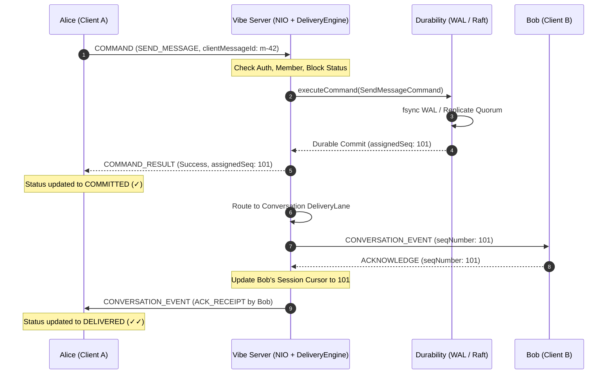

# Vibe Delivery Guarantees and Message Semantics

This document defines the formal delivery guarantees, ordering semantics, acknowledgment lifecycle, and failure recovery protocols enforced by Vibe.



## 1. Core Guarantees Summary

| Guarantee | Mechanism | Scope |
| :--- | :--- | :--- |
| **Monotonic Total Ordering** | 64-bit sequence counter per conversation | Scoped to each conversation lane |
| **At-Least-Once Delivery** | Persistent outbox + cursor replay resumption | End-to-end between client and cluster |
| **Idempotent Deduplication** | `IdempotencyKey(userId, deviceId, clientMessageId)` | Server-side commit log and in-memory cache |
| **Durability Pre-condition** | Disk fsync (WAL) or Majority Quorum commit (Raft) | Required before `COMMAND_RESULT` acknowledgment |
| **Multi-Device Sync** | Broadcast fanout across all active user sessions | All devices registered to the same `userId` |
| **Bounded Queue Protection** | Max 2048 frames or 4 MiB per session | Backpressure drop for signals; cursor eviction for slow consumers |

## 2. Message Lifecycle Phases

1. **Tentative Local Enqueue (`PENDING_OUTBOX`)**:
   When a user clicks send or presses Enter, the SDK records the message in local SQLite with status `PENDING_OUTBOX` and an immutable `clientMessageId`. The UI renders the message immediately with a pending clock icon (`⏳`).
2. **Durable Cluster Commit (`COMMITTED`)**:
   The frame is transmitted over the multiplexed socket. The server verifies caller authorization, checks membership and block lists, and commits the mutation to the durability engine. Only after the WAL segment fsync finishes or Raft consensus succeeds is `COMMAND_RESULT` returned to the sender. The sender updates status to `COMMITTED` (`✓`).
3. **Monotonic Lane Fanout (`DELIVERED`)**:
   The `DeliveryEngine` hashes the conversation ID to select a dedicated `DeliveryLane`. The message is delivered in exact sequential order to all active recipient sessions. When the recipient acknowledges receipt via `ACKNOWLEDGE`, the server updates the recipient's cursor and notifies the sender, who updates the message to `DELIVERED` (`✓✓`).
4. **Read Receipt (`READ`)**:
   When the recipient displays the message in the foreground, a `READ_RECEIPT` event is dispatched. The sender updates the message icon to colored double checkmarks.

## 3. Idempotency and Retries

Network sockets can drop after the server commits a message but before the client receives the acknowledgment frame.
- **Client Behavior**: When the client reconnects, its outbox drainer retransmits unacknowledged `PENDING_OUTBOX` items carrying their original `clientMessageId`.
- **Server Behavior**: The `DomainStateMachine` tracks a bounded LRU cache of recently committed idempotency keys:
  ```java
  public record IdempotencyKey(String userId, String deviceId, String clientMessageId) {}
  ```
  If an incoming command matches an existing key with identical content hash, the server immediately returns the previously assigned sequence number and success payload without re-executing state mutation or duplicating fanout.
- **Conflict Detection**: If a client reuses an idempotency key with different payload content, the server rejects the command with `ErrorCode.DOMAIN_IDEMPOTENCY_CONFLICT` to protect history integrity.

## 4. Replay and Resumption Protocol

When a client reconnects after an outage or slow-consumer eviction:
1. Client sends a `SUBSCRIBE` or `RESUME` frame containing its last acknowledged sequence number (`lastKnownSeq`).
2. The server verifies that the caller is still an active conversation member.
3. The server queries committed history:
   ```java
   List<Message> messages = stateMachine.getMessages(conversationId, lastKnownSeq + 1, limit);
   ```
4. Missed messages are replayed sequentially over the socket.
5. If the user joined recently and the conversation enforces `HistoryVisibility.FROM_JOIN`, replay filters out all messages committed prior to the user's join sequence.
