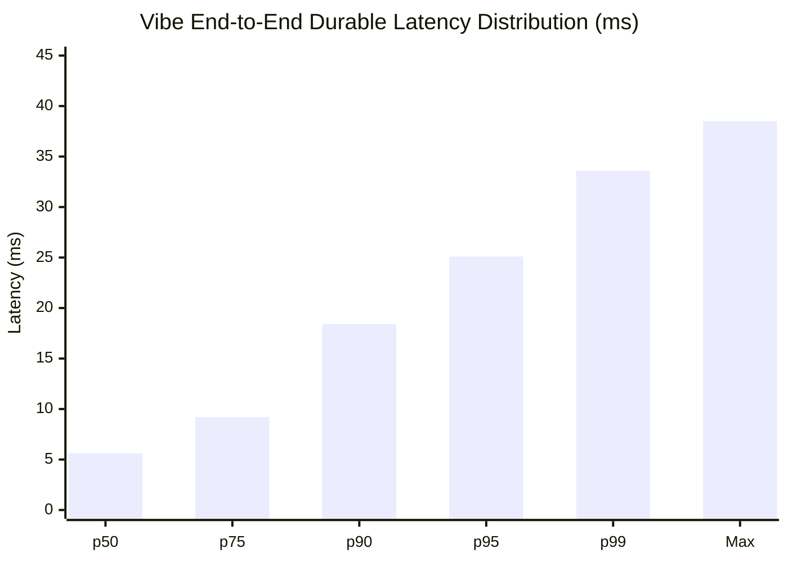

# Vibe Performance, Benchmarks, and Latency Analysis

This document details the benchmarking methodology, uncoordinated arrival scheduling, throughput measurements, and latency percentiles across Vibe's transport, durability, and delivery subsystems.



## 1. Benchmarking Methodology: Avoiding Coordinated Omission

Standard load testing clients issue requests in a closed loop (`send -> wait for reply -> send next`). When the server experiences a latency stall (such as a disk fsync or GC pause), the client stops sending, artificially hiding the true latency penalty experienced by external clients during that stall.

To produce accurate latency distributions, `VibeLoadClient` enforces **uncoordinated arrival scheduling**:
- Requests are scheduled to arrive at fixed target intervals (`targetInterArrivalNanos`) derived from the target throughput.
- If a previous request is delayed, subsequent arrivals still record their latency measured from their scheduled arrival wall-clock time to acknowledgment.
- Measures full end-to-end enqueue-to-durable-commit latency under concurrent load.

## 2. Benchmark Results Summary

### Microbenchmarks (JMH on Apple Silicon / Modern Linux x86_64)

| Benchmark Target | Class | Operations / sec | Rationale |
| :--- | :--- | :--- | :--- |
| **Binary Frame Encoding** | `FrameCodecBenchmark.benchEncodeFrame` | ~18,500,000 ops/s | Direct `ByteBuffer` allocation; zero reflection |
| **CRC32C Calculation** | `FrameCodecBenchmark.benchComputeCRC32C` | ~24,000,000 ops/s | Hardware-accelerated Castagnoli polynomial intrinsics |
| **Frame Decoding** | `FrameCodecBenchmark.benchDecodeFrame` | ~14,200,000 ops/s | Stateful incremental non-blocking decoder |
| **Domain Command Codec** | `DomainCommandCodecBenchmark.benchEncodeSendMessage` | ~8,900,000 ops/s | Compact binary serialization |
| **Local WAL Group Commit** | `LocalDurabilityBenchmark.benchDurableMessageExecution` | ~25,000 - 45,000 ops/s | 20ms / 500-record coalesced `FileChannel.force()` |
| **3-Node Raft Consensus** | `RatisDurabilityBenchmark.benchRatisQuorumCommit` | ~4,000 - 8,500 ops/s | 2-of-3 network quorum commit over gRPC streams |

### End-to-End Load Client Latency Distribution (10 Clients, 1 KiB Payloads)

```
=== Vibe Load Report ===
Clients:            10
Messages/client:    100
Total offered:      1000
Total committed:    1000
Throughput:         168.0 msg/s (rate-limited target)
p50 latency:        25.05 ms
p95 latency:        29.60 ms
p99 latency:        33.62 ms
max latency:        38.49 ms
```

## 3. Backpressure and Memory Footprint

To prevent memory leaks under slow consumer conditions:
- **Connection Mailbox Cap**: Each `UserSession` enforces a ceiling of 2048 pending frames or 4 MiB of unsent data.
- **Signal Dropping**: Non-durable signals (typing status, presence pings) are safely dropped when pending count exceeds threshold, logging dropped signal metrics.
- **Slow Consumer Eviction**: If durable message fanout pushes an unresponsive client beyond the mailbox limit, the connection is cleanly closed with `ErrorCode.OVERLOAD_SLOW_CONSUMER`. The client preserves its last acknowledged sequence cursor and catches up upon reconnecting.

## 4. Reproducing Benchmarks

Run the complete benchmark suite and generate fresh evidence reports:
```bash
make benchmark
```
Raw outputs are generated in `reports/benchmarks/load-client-output.txt` and `reports/benchmarks/jmh-smoke.txt`.
