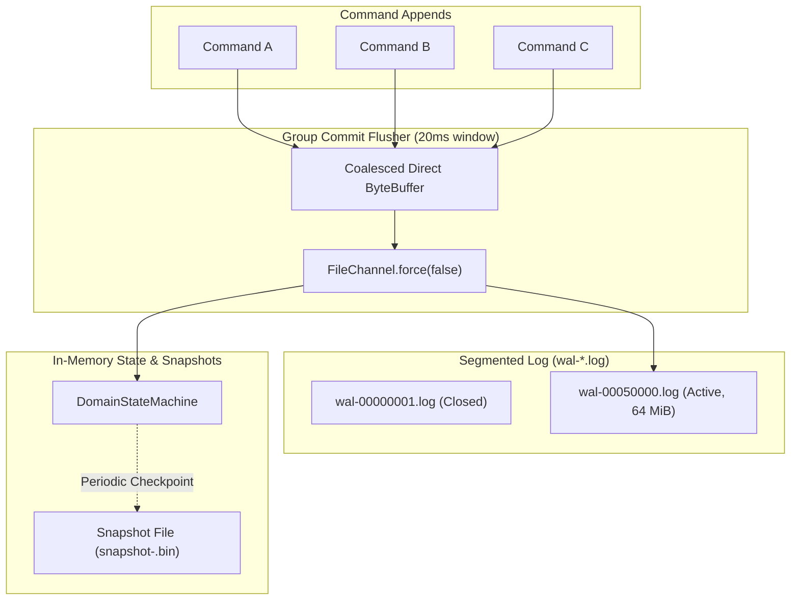

# Vibe Storage Engine and Crash Recovery Specification

This document details the storage architecture, Write-Ahead Log (WAL) layout, group commit synchronization, snapshotting mechanics, and failure recovery protocols in Vibe.



## 1. Segmented Write-Ahead Log (WAL) Architecture

In standalone local durability mode, Vibe utilizes `SegmentedWal`:
- **Segment Sizing**: Segments are pre-allocated at 64 MiB (`wal-<startIndex>.log`). When a segment exceeds capacity, it is fsynced, closed, and a new active segment is initialized.
- **Binary Record Layout**:
  Each record appended to the log follows a strict length-prefixed format protected by CRC32C:
  ```
  +------------------+------------------+-----------------------+----------------------+
  | Length (4 Bytes) |  Seq (8 Bytes)   | Payload (N-16 Bytes)  | CRC32C (4 Bytes)     |
  +------------------+------------------+-----------------------+----------------------+
  ```
- **Integrity Validation**: The CRC32C checksum covers the record payload, sequence, and length. During recovery replay, any record with a mismatched CRC32C triggers an immediate recovery error.

## 2. Group Commit Optimization

Individual `fsync` calls on spinning disks or SSDs take between 1ms and 15ms. Issuing `fsync` synchronously for every individual message limits throughput to ~100-500 operations per second.

`SegmentedWal` implements group commit batching:
1. Callers submit commands to an in-memory queue (`appendQueue`), returning a `CompletableFuture<Long>`.
2. A dedicated background flusher thread wakes up when:
   - The number of pending records reaches `maxBatchRecords` (default: 500).
   - Or the batch timer expires (`batchTimeoutMs`, default: 20ms).
3. The flusher coalesces all queued records into a contiguous direct buffer, writes them to the `FileChannel` in a single system call, and invokes `FileChannel.force(false)`.
4. Upon successful return of `force()`, all pending futures in the batch are completed simultaneously.

## 3. Crash Recovery and Torn Write Truncation

When the server terminates abruptly (e.g. power loss, OS crash, or `SIGKILL`), the active WAL segment may contain an incomplete write at its tail.

Vibe guarantees zero lost acknowledged commits through the following recovery protocol:
1. **Find Latest Snapshot**: Locate the most recent complete `snapshot-<lastIndex>.bin`. If found, deserialize it into `DomainStateMachine`.
2. **Scan WAL Segments**: Open all log segments starting from the snapshot index in ascending order.
3. **Validate Records**: Read records sequentially and verify CRC32C checksums.
4. **Torn Tail Handling**:
   - If the log reaches EOF or encounters an uncompleted tail record at the end of the latest segment, the log reader checks if this uncompleted record was ever acknowledged. Because the flusher only completes caller futures after `force()`, an uncompleted record was never acknowledged to any client.
   - The WAL automatically truncates the corrupted tail, restoring the segment to the last valid fsynced record position.
5. **Middle-of-Log Corruptions**: If a checksum mismatch occurs followed by valid subsequent records, this represents storage media corruption. The server aborts with a fatal diagnostic error rather than silently proceeding with divergent state.

## 4. State Machine Snapshots

To prevent unbounded log replay on restart, `LocalDurabilityAdapter` periodically takes point-in-time state snapshots:
1. The `DomainStateMachine` is captured into a compact binary format.
2. The snapshot is written to a temporary file (`snapshot-<index>.tmp`).
3. Once flushed and closed, the file is atomically renamed to `snapshot-<index>.bin`.
4. WAL segments containing only indices preceding the snapshot are eligible for background retention cleanup.
